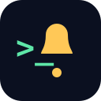

<p align="center">
  
</p>

<h1 align="center">@gocode/notify</h1>

<p align="center">
  <strong>Get a push notification on your phone the moment your AI coding agent finishes.</strong><br/>
  Cursor · Claude Code · OpenCode · Ralph/Homer loops — installed with <em>one</em> command.
</p>

<p align="center">
  <a href="https://www.npmjs.com/package/@gocode/notify"></a>
  <a href="LICENSE"></a>
  
  
</p>

```bash
npx @gocode/notify@latest setup
```

<p align="center">
  <!-- Joseph: drop a 2-3s screen recording of the phone notification arriving here. -->
  
</p>

---

## Why?

You kick off a long agent run, then walk away to make coffee, take a call, or
context-switch to something else. Now you're stuck in the loop of *checking back
every 30 seconds* to see if it's done — or worse, it finished 20 minutes ago and
you didn't notice.

**`@gocode/notify` pings your phone the instant your agent finishes a turn, goes
idle waiting for you, errors out, or an overnight loop completes/halts.** Walk
away. Your phone tells you when it needs you.

- ⚡ **One command.** `npx @gocode/notify@latest setup` — no server to host, no config files to hand-edit.
- 🔒 **Push-only & private.** The paired key can *only* send notifications to your phone. It can't read your chats, code, or settings. Revoke it any time.
- 🧩 **Auto-detects your tools.** Wires up Cursor, Claude Code, and OpenCode in one go — never clobbering your existing hooks/MCP config.
- 🪶 **Never blocks your agent.** Every send is fire-and-forget with a hard timeout + an offline queue. A slow push can't slow your work.

## Works with

| Tool | How it hooks in |
|---|---|
| **Cursor** | `stop` hook |
| **Claude Code** | `Stop` + `Notification` + `SubagentStop` hooks |
| **OpenCode** | runtime hook |
| **Ralph / Homer loops** | opt-in completion/halt snippet |

> Notifications are delivered through the free **[GoCode](https://oh.jeltechsolutions.com)**
> phone app (the one-time pairing target). Install GoCode, pair once, done.

## Contents

- [Install — two equally-supported paths](#install--two-equally-supported-paths)
- [Pairing — step by step](#pairing--step-by-step)
- [The three triggers](#the-three-triggers)
- [Ralph/Homer opt-in snippet (trigger C)](#ralphhomer-opt-in-snippet-trigger-c)
- [Troubleshooting](#troubleshooting)
- [Develop](#develop)
- [Layout](#layout)

## Install — two equally-supported paths

Both paths converge on the same installer (`gocode-notify setup`): it pairs this
machine, auto-detects your agent runtimes, and merges the hooks + MCP server +
anti-double-ping rule into each one's config (never clobbering your existing
settings; safe to re-run).

### Path 1 — paste a one-liner into your terminal

```bash
npx @gocode/notify@latest setup
```

This runs the interactive installer: it prompts for the 6-digit pairing code
(from the GoCode app → **"Connect a coding agent"**), then detects and configures
Claude Code / Cursor / OpenCode. Re-run any time — it's idempotent; pass
`--force` to re-pair.

> First time? You'll need the free **[GoCode](https://oh.jeltechsolutions.com)**
> app on your phone to receive the pushes and to generate the 6-digit pairing
> code (Settings → **"Connect a coding agent"**).

### Path 2 — paste a prompt into your AI agent and let it install

Hand this to Cursor / Claude Code and the agent does the install for you. The
`--agent-driven` flag suppresses interactive prompts and emits one JSON line per
step so the agent can verify each one:

```
Install GoCode phone notifications for this machine. Run:
  npx @gocode/notify@latest setup --agent-driven --pair-code <CODE>
Then confirm the hooks and MCP server were written, and run
  npx @gocode/notify@latest test
to send a test push to my phone. Report whether the test push arrived.
```

Replace `<CODE>` with the 6-digit code from the GoCode app. `--agent-driven` is
fully idempotent and machine-readable; it never spawns a prompt.

## Pairing — step by step

A dev machine running agent hooks has no GoCode login (no JWT), so it can't use
GitHub OAuth. Instead you pair it once with a short-lived **6-digit code**, which
the CLI exchanges for a scoped, push-only **API key** stored locally. The key can
only send pushes to *your* phone — it can't read chats, settings, or trigger any
agent action, and you can revoke it from the app at any time.

1. **In the GoCode app**, open **Settings → "Connect a coding agent"**. The app
   shows a large 6-digit code (valid 10 minutes), a copyable
   `npx @gocode/notify login --code 123456` line, and a 10:00 countdown. Tap
   **"Generate new code"** if it expires.
2. **On the machine**, either run the full installer (`npx @gocode/notify@latest
   setup`, which pairs *and* writes your agent configs) or just pair on its own:

   ```bash
   # Interactive — prompts for the code:
   npx @gocode/notify@latest login

   # Or pass it directly (and optionally label this machine):
   npx @gocode/notify@latest login --code 123456 --label "MacBook Pro — Cursor"
   ```
3. The CLI calls the server's `pair/claim` endpoint, receives the API key **once**,
   and writes it to `~/.gocode/credentials` (chmod `600`). The app flips to a
   **"connected ✓"** success state showing the machine's label.
4. **Verify the round-trip** with a real push to your phone:

   ```bash
   npx @gocode/notify@latest test
   ```

   A "GoCode test" notification should arrive on your paired device. If it
   doesn't, see [Troubleshooting](#troubleshooting).

**Re-pairing.** Both `login` and `setup` are idempotent — re-running them won't
clobber an existing pairing. To deliberately replace the stored key (new machine
owner, rotated key), pass `--force` to `setup` (or just run `login` again with a
fresh code). Revoke an old machine from the app's **"Connected agents"** screen.

**Server selection.** Pairing and every send resolve the server URL in this
precedence order: the `--server` flag → the `GOCODE_SERVER` env var → the value
saved in `~/.gocode/credentials` → the built-in default
(`https://oh.jeltechsolutions.com`). You only need `--server` for a self-hosted
or staging GoCode server.

## The three triggers

| Trigger | Mechanism | Fires when |
|---|---|---|
| **(A) Runtime hook** | Cursor `stop` / Claude Code `Stop`+`Notification`+`SubagentStop` | Agent finishes a turn, goes idle, or errors — **automatic, the killer feature** |
| **(B) MCP tool** | `gocode_notify` tool the agent calls | You *explicitly* ask "ping me when X is done" mid-task |
| **(C) Loop shell hook** | one line in your loop's completion/halt path | A Ralph/Homer loop reaches `completed` / `halted` |

The installed rule/skill tells the agent **not** to call the MCP tool for
done/idle/error pings — those are owned by the deterministic hook (A), so you
never get double-pinged.

## Ralph/Homer opt-in snippet (trigger C)

For power users running a loop **they control** (this repo's `ralph`/`homer`
skills, a `while :; do … done` one-liner, or any custom driver), drop these two
lines into the loop's completion/halt path:

```bash
# At loop completion:
gocode-notify send --kind loop_completed --source ralph --project "$(basename "$PWD")" || true
# At loop halt (paused_max_failures / awaiting_human):
gocode-notify send --kind loop_halted --source ralph --project "$(basename "$PWD")" \
  --title "Ralph halted — needs you" || true
```

The ready-to-copy version with comments lives at
[`snippets/ralph-homer.sh`](snippets/ralph-homer.sh).

**This is opt-in and never auto-injected** — the installer does not edit your
loop scripts. Both lines are fire-and-forget (`|| true` + the CLI's 5s
self-timeout), so a failed or slow push can never block or fail your loop.

## Troubleshooting

**Start here:** `gocode-notify status` prints a one-screen report — whether
credentials are present (and the bound user/label), whether the server is
reachable, which agent runtimes were detected, and whether each one's config has
been written. Most issues below are diagnosable from that output.

| Symptom | Likely cause & fix |
|---|---|
| `test` / `send` prints **"not paired"** | No `~/.gocode/credentials`. Run `gocode-notify login` and pair from the app (see [Pairing](#pairing--step-by-step)). |
| **Pairing fails** ("invalid or expired code") | Codes expire after 10 min and are single-use. Tap **"Generate new code"** in the app and re-run `login` with the fresh code. |
| `status` shows **Server: not reachable** | Network/DNS/firewall, or a wrong server URL. Confirm you can reach `https://oh.jeltechsolutions.com`; check the `--server` flag / `GOCODE_SERVER` env / the `server` field in `~/.gocode/credentials`. |
| **No push arrives** even though `test` exits 0 | The send is fire-and-forget and exits 0 even on failure — check `~/.gocode/notify.log` for the real error. Also confirm push permissions are granted in the GoCode app and the device token is registered (re-open the app once after signing in). |
| **Double pings** (two notifications per event) | The agent is calling the `gocode_notify` MCP tool *and* the runtime hook is firing. Re-run `setup` so the anti-double-ping rule/skill is installed; it tells the agent not to notify for automatic done/idle/error events. |
| **Hook doesn't fire** in Cursor / Claude Code | Re-run `setup` and check `status` shows "config written" for that runtime. Restart the agent app so it reloads `~/.cursor/hooks.json` / `~/.claude/settings.json`. The hooks are merged, never clobbered — your existing hooks are preserved. |
| **Pushes queue up while offline** then arrive later | Expected. Sends made while the server is unreachable are enqueued to `~/.gocode/outbox/` (size-capped, drop-oldest) and flushed best-effort on the next `send`. A missed "done" ping is acceptable; a blocked agent is not. |
| **`npx @gocode/notify` can't find the package** | Make sure you're online and using the scoped name exactly: `npx @gocode/notify@latest setup`. Clear a stale npx cache with `npx clear-npx-cache` (or `rm -rf ~/.npm/_npx`) and retry. |
| **Want it gone** | `gocode-notify uninstall` removes exactly the hook/MCP/rule entries this tool added (nothing else). Delete `~/.gocode/` to also drop the stored credentials, and revoke the key from the app's **"Connected agents"** screen. |

**Logs & files.** Failures are appended to `~/.gocode/notify.log` (size-capped,
rotated to `notify.log.1`). Credentials live in `~/.gocode/credentials` (chmod
`600`); non-secret prefs in `~/.gocode/config.json`; the offline queue in
`~/.gocode/outbox/`.

Found a bug or have a feature idea? Please
[open an issue](https://github.com/joseph-lewis/gocode-notify/issues) — issues are
welcome and usually get a reply within a day or two.

## Develop

```bash
git clone https://github.com/joseph-lewis/gocode-notify.git
cd gocode-notify
npm install
npm run build      # compile TypeScript -> dist/
npm test           # builds, then runs node --test on dist/test/
npm run typecheck  # type-check only, no emit
```

Zero runtime dependencies beyond the MCP SDK (Node built-in `fetch`/`fs`/
`readline` for everything else). Tests use Node's built-in test runner
(`node:test`).

## Layout

| Path | Purpose |
|---|---|
| `src/cli.ts` | `gocode-notify` bin entrypoint + command dispatcher |
| `src/setup.ts` | Installer orchestration (pair → detect → write configs) |
| `src/claude.ts` / `src/cursor.ts` | Per-client config writers (hooks + MCP + rule/skill) |
| `src/send.ts` / `src/login.ts` / `src/mcp.ts` | Core send, pairing, and MCP server |
| `snippets/ralph-homer.sh` | Opt-in loop completion/halt snippet (trigger C) |
| `test/` | `node:test` smoke + unit tests |
